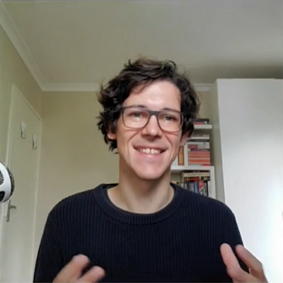

I am an Associate Professor in [Electrical and Electronic Engineering](http://www.ee.sun.ac.za/) at [Stellenbosch University](http://www.sun.ac.za/), South Africa. Before moving (back) to South Africa, I did a postdoc at [TTI-Chicago](http://www.ttic.edu/) with [Karen Livescu](http://ttic.uchicago.edu/~klivescu/) and [Greg Shakhnarovich](http://ttic.uchicago.edu/~gregory/) on multi-modal machine learning models combining speech and vision. I obtained my PhD in 2016 from the [University of Edinburgh](http://web.inf.ed.ac.uk/ilcc), where I was supervised by [Sharon Goldwater](http://homepages.inf.ed.ac.uk/sgwater/), [Aren Jansen](https://sites.google.com/view/ajansen-pubs) and [Simon King](http://homepages.inf.ed.ac.uk/simonk/); I worked on unsupervised speech processing, and played around with unsupervised Bayesian and neural models.

I am a researcher in machine learning with a focus on speech processing. I aim to develop methods that would allow machines to acquire language autonomously, using as little supervision as possible. Through this, I hope to gain new insights into machine and human learning.

  

    <a href="m&#x61;&#105;l&#x74;&#111;:{{ site.email }}" title="email"><i class="fas fa-envelope"></i></a>
    <a href="https://github.com/{{ site.github_username }}" title="GitHub" rel="external nofollow noopener" target="_blank"><i class="fab fa-github"></i></a>
    <a href="https://www.youtube.com/c/HermanKamperML" rel="external nofollow noopener" target="_blank"><i class="fab fa-youtube"></i></a>
    <a href="{{ site.google_scholar }}" title="Google Scholar" rel="external nofollow noopener" target="_blank"><i class="fas fa-fw fa-graduation-cap"></i></a>
  

<!--
   

  

  <a href="m&#x61;&#105;l&#x74;&#111;:{{ site.email }}"><i class="far fa-envelope" aria-hidden="true"></i> Email</a>&ensp;
  <a href="https://github.com/{{ site.github_username }}"><i class="fab fa-github" aria-hidden="true"></i> GitHub</a>&ensp;
  <a href="https://www.youtube.com/c/HermanKamperML"><i class="fab fa-youtube"></i> YouTube</a>&ensp;
  <a href="{{ site.google_scholar }}"><i class="fas fa-fw fa-graduation-cap" aria-hidden="true"></i>&nbsp;Scholar</a>
  <a href="{{ site.google_scholar }}"><i class="ai ai-google-scholar" aria-hidden="true"></i>&nbsp;Scholar</a>
  

-->
