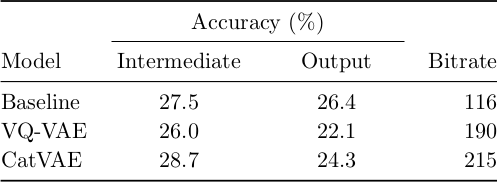

There are many good resources on the structure and philosophy behind academic
writing. I mention some of these in the first section below. But this note is
different: it is simply a (growing) list of things that I keep on telling
students when reviewing paper or thesis drafts. These are mainly about
nitty-gritty things (instead of the bigger story, which is arguably more
important). But it is still important to get these things right.

Two disclaimers. First, parts of this note convey my personal writing
preferences (and it might sound quite opinionated, because it is). I try to
state when something is a stylistic choice rather than a rule which you should
really follow. Second, I wrote parts of the note in anger, normally after
reviewing many paper and thesis drafts in a short space of time. So sorry if I
sometimes sound a bit blunt!

Writing structure and philosophy
--------------------------------
There are many good resources on the structure and bigger picture behind
academic writing. Here are some of my favourites on specific topics:

- I subscribe to the philosophy that a paper should really focus on a single
  idea told through one story. See points 2 and 3 in [Simon Peyton Jones'
  slides](https://www.microsoft.com/en-us/research/academic-program/write-great-research-paper/).
- [How to write an
  abstract](http://users.ece.cmu.edu/~koopman/essays/abstract.html), by Philip
  Koopman.
- [Paper content and
  organization](https://homepages.inf.ed.ac.uk/sgwater/writing/content.html),
  by Sharon Goldwater.

We don't clap hands for basics
------------------------------
We all make mistakes and try to learn from them. But some mistakes make me
really sad. Here are some basics that I expect when a student gives me a draft:

- Spelling mistakes. With today's word processors, editors and tools, there is
  no excuse for spelling mistakes.
- If you have a figure or table, you need to refer to it and describe it
  somewhere in the text.
- If I gave feedback on a previous draft, I expect that you work the
  recommendations into the entire document. I often fix a mistake only where it
  occurs the first time. I then assume you will fix all occurrences of this
  mistake throughout the entire draft.

General comments
----------------
- With whatever you do (spelling, figures, table layout, capitalisation,
  section headings), be consistent!
- Choose either British or American spelling, and stick to it. This means that
  you won't have "initialize" in Section 2 and "initialise" in Section 4.
- Avoid subjective and emotive language. For instance, when describing results,
  don't say that the results are "disappointing" or "remarkable" or
  "impressive". Simply state the facts: "model X performs 10% worse than model
  Y". Sometimes you can say that something is unexpected or surprising, but
  then you need to unpack why you say so, and help the reader see what you are
  seeing.

Mathematics
-----------
- *Consistent mathematical notation.* If $x$ is used to represent something in
  Section 1, then $x$ shouldn't be used for something else in Section 3.
  Sometimes it is difficult to be entirely consistent (this is often the case
  in bigger documents like a thesis). But then you need to tell the reader
  clearly that you are being sloppy with your notation (and why).
- We sometimes use "proper" words or abbreviations to denote an operation
  within a mathematical expression. For instance, we use "max" to denote
  maximisation or "log" to indicate taking the logarithm. In these cases, the
  operation should be denoted with an upright font, i.e. $\textrm{max}(x)$, not
  $max(x)$. The latter implies a multiplication of variables: $m \cdot a
  \cdot x \cdot (x)$. You should also use an upright font if you use a word as
  a sub- or superscript to denote some properties of a variable: for instance,
  you should write $y_\textrm{pair}$ and not $y_{pair}$.
- There are different ways to refer to an equation in the text. Choose how you
  will refer to equations and do so consistently. For instance, either write
  "the loss is shown in (3.3)" or "the loss is shown in Equation 3.3". Do not
  mix the two!

Figures and tables
------------------
- Figure and table captions are always full sentences. The caption should be
  self-contained, i.e. it should be possible for the reader to get a fairly
  good understanding of the figure or table by just reading the caption. This
  means that "Model diagram" or "Illustration of the AwsmeCat approach" are not
  good captions.
- If you did not make a figure yourself, it requires a citation in the figure
  caption otherwise it is plagiarism. You can also ask the author directly
  whether it is okay to use their figure; then you should not only cite them,
  but also thank them in acknowledgements. The best approach is probably to
  just remake the figure, so that it is consistent with the other figures in
  your document (but even then, it is good to add a citation to the figure
  caption).
- Try to place figures or tables close to where they are first mentioned.
- Try to put tables and figures at the top or bottom of a page. This is not a
  hard rule (although it might be for some journals or conferences). But a hard
  rule I do use is that I do not split paragraphs with a figure. This means
  that, if the figure is not at the top or bottom of the page, it will be
  in-between the end of a section and the heading of the next section.
- If you use LaTeX, use proper names when labelling your figures or tables. For
  instance, don't use `\label{fig7}`, but use something like
  `\label{fig:tsne_acoustic_embeddings}`. This is not so important for a short
  paper or report, but for a long document, proper labels can be very helpful
  (especially when using a LaTeX editor with autocomplete that gives you a list
  of defined labels after typing `\ref`).

*A bit more on table layout.* If you use LaTeX, make sure to learn how to use
the `tabularx` and `booktabs` packages. The `tabularx` package allows you to
stretch your table to (a fraction of) the text or column width. The `booktabs`
packages helps with layout and making tables pretty, but more importantly, the
first two sections of the [booktabs
manual](http://mirrors.ctan.org/macros/latex/contrib/booktabs/booktabs.pdf)
give an opinionated rant about how to format tables. I recommend that you read
those two sections and follow the guidelines. I specifically subscribe to the
two rules given there:

1. Never use vertical rules.
2. Never use double rules.

This means tha tables would typically look something like this:

\ \

This is somewhat of a personal choice, but I do think that removing vertical
rules makes tables look a lot better and improves readability.

Bibliography
------------
Make sure that that the references in your bibliography are consistent:

- I generally make sure that the referencing format for all conferences papers
  are exactly the same and that the format for all journal articles are the
  same.
- Decide whether you are going to abbreviate conferences or not, and then do so
  consistently. E.g., in the same bibliography you should not have "in
  *Proceedings of the IEEE International Conference on Acoustics, Speech and
  Signal Processing (ICASSP)*" and "in *Proc. ICASSP*". Choose one format and
  stick to it. I prefer to use the shortened abbreviation format everywhere
  (since this saves space and is easier to keep consistent), but the important
  thing is to be consistent.
- If you include the page numbers and the location for a conference, you need
  to do this for all the conference papers you cite. I prefer not too include
  these details for conference papers (again, since this then makes it easier
  to maintain a consistent bibliography).
- Similarly, if you add page numbers, the volume and the number for a journal
  article, you should do so for all the journals. I tend to include this
  information for journals.
- If there is a conference or a journal version of an arXiv paper, cite the
  published version.
- Decide whether you are going to add the DOI and online link to papers, and
  then do so consistently. Here I would (almost definitely) advise to leave
  this information out, since it can be hard to obtain for all publications.
- Do not trust BibTeX entries drawn automatically from Google Scholar or
  applications like Mendeley. You need to go through these to make sure they
  are correct and that they are consistent with your own formatting.

As an example, consider the following bibliography:

1. L. Besacier, E. Barnard, A. Karpov, and T. Schultz, "Automatic speech
   recognition for under-resourced languages: A survey," *Speech Commun.*, vol.
   56, no. 1, pp. 85--100, 2014.
2. Y. Zhang and J. R. Glass, "Unsupervised spoken keyword spotting via
   segmental DTW on Gaussian posteriorgrams," in *Proc. ASRU*, 2009.
3. K. L. Levin, A. Jansen, and B. Van Durme, "Segmental acoustic indexing for
   zero resource keyword searh," *2015 IEEE International Conference on
   Acoustics, Speech and Signal Processing (ICASSP)*, 2015.
4. A. Jansen, E. Dupoux, S. J. Goldwater, "A summary of the 2012 jhu clsp
   workshop on zero resource speech technologies and models of early language
   acquisition," in *IEEE International Conference on Acoustics, Speech and
   Signal Processing*, May 2013, pp. 8111--8115.
5. M. Heck, S. Sakti, and S. Nakamura, "Learning supervised feature
   transformations on zero resources for improved acoustic unit discovery,"
   *IEICE T. Inf. Syst.*, vol. 101, no. 1, pp. 205--214, 2018.

Both the journals [1] and [5] are abbreviated and contain the volume, number
and page numbers, so these are consistent. The conference papers [2--4] are not
consistent: [2] is abbreviated, while [3] and [4] are not. The year occurs
twice in [3], which could be okay but then this should also be done in [2] and
[4]. In reference [4], page numbers are given as well as the month of the
conference; again this could be okay, but then this should be added for [2] and
[3] as well. There is an additional issue in [4]: "jhu clsp" are abbreviations
which should be capitalised, i.e. "JHU CLSP".

LaTeX-specific recommendations
------------------------------
- I recommend using the `microtype` package. It basically moves and spaces
  letters so that a document looks more beautiful. More importantly, it often
  reduces the length of a paper since it reduces the number of dangling words
  (when the last word of a paragraph ends up on a line of its own).
- Put each sentence on a new line in your LaTeX code. Alternatively, partial
  sentences can be put on new lines. But don't have a whole paragraph on a
  single line. There are several reasons for this:
    - If you use version control (git) and a whole paragraph is on a single
      line and you change a single word, then that whole paragraph will be
      flagged as a change. This can be especially irritating when collaborating
      with others on a LaTeX document through git.
    - Similarly, if you do a `diff` on a document later to see changes, then
      the whole paragraph will be marked as a change.
    - Some LaTeX editors (including Overleaf) allows you to do backward search,
      where you can click on a PDF preview of the document and then jump to the
      corresponding line of code. (Forward search is the opposite, where you
      jump from a line in the code to the corresponding point in the PDF.) If
      you place each paragraph on a single line in your code and you perform
      backward search, then you would jump to the paragraph and will need to
      find the particular sentence or word that you are looking for. If
      sentences or partial sentences are placed on new lines in your LaTeX
      source, then it is much easier to find your place when doing backward
      search.
- Splitting your LaTeX source into multiple files:
    - Break up your document into separate `.tex` files.  Then in the main
      file, use `\input` to pull in the separate `.tex` files. This means that
      I would typically have a `introduction.tex`, `related_work.tex`,
      `models.tex`, etc. file for a single paper.
    - This again helps when collaborating on a single document with multiple
      authors through git, making it easier to isolate where changes have
      happened.
    - It also really helps with larger documents like theses.
    - But **I do not do this when using Overleaf**, since separate files
      sometimes break the forward and backward search functionality. (This is
      maybe one more reason why I am not a huge Overleaf fan, but I think it's
      just me.)
- More on version control with LaTeX:
    - Make sure that `.pdf`, `.aux`, `.bbl` and other file types produced as
      part of the document build process are not included or tracked in your
      repository (basically anything that is not source or figures). I use
      `.gitignore` files to do this.
    - *Make sure your editor doesn't overwrite changes when pulling in changes
      for an open file.* I once had a horrible experience with a collaborator
      using a LaTeX editor which really broke our document. We were
      collaborating from a common git repository. The collaborator was pulling
      from git using the command line. But his editor wasn't reloading the
      files after a pull. This meant that he would pull (without getting the
      updates), continue to edit, and then my changes were lost the moment he
      saved. I guess this is an edge case with a particular way of
      collaborating and editing, but it caused a lot of sadness.

Conventions
-----------
These are some personal conventions I follow (and might also recommend/force
onto students).

- *Abbreviations.* In a paper, I write out abbreviations---such as hidden
  Markov model (HMM)---in the abstract, at first use in the body, and also in
  the conclusion. I do his since I think these sections should be
  self-contained. I also (normally) write out abbreviations in section
  headings.
- *Tenses.* It is often tricky to know what tense (past, present, future) to
  use for different sections. My own convention is always to write in the
  present tense, except for the Conclusion, which I write in the past tense.
  Many students tend to write the Abstract in the future tense, e.g. "we will
  propose a model", but I prefer to also write the Abstract in the present
  tense, e.g. "we propose a model". There are some cases where I would make an
  exception in the body and write in the past tense instead of the present
  tense; this is normally when I refer back to something that has happened in a
  previous section or chapter, e.g. "In Section 3.1 we found that ...".
- "3" vs. "three": I write out the words for numbers up to twelve, and from
  then on write out the number. E.g. I would write "13 layers", but would write
  "five captions".
- In a thesis, book, or longer report, I often start a chapter with a paragraph
  explaining what the reader should expect in that chapter.  I also often
  finish with a final section like "Chapter summary", explaining what the
  reader should take away from that chapter and how it links with happens next
  and in the rest of the document.

General writing strategies
--------------------------
- *Struggling to write.* Like everyone, I sometimes get writer's block. One
  thing I sometimes do which helps, is to write using pen and paper, away from
  my computer. There is something about this analogue process that helps with
  the struggle of starting to write. I realise this might not work for
  everyone, but I've written large parts of some papers in my notebook
  (sometimes on a long flight---I don't like taking out my laptop).
- After explaining something once in a paper, I sometimes feel like explaining
  it in a slightly different way in a follow-up sentence or paragraph. This is
  normally a great indication that I didn't explain the concept well in the
  first place: I need to go back and rewrite it.

Stellenbosch University template
--------------------------------

Acknowledgements
----------------
I changed the way I format tables after I received an email from Iain Murray; I
had given a talk with some nasty looking tables on some of the slides, and he
sent a kind email with some great recommendations.

Leanne Nortje edited and made suggestions for parts of the template above.

